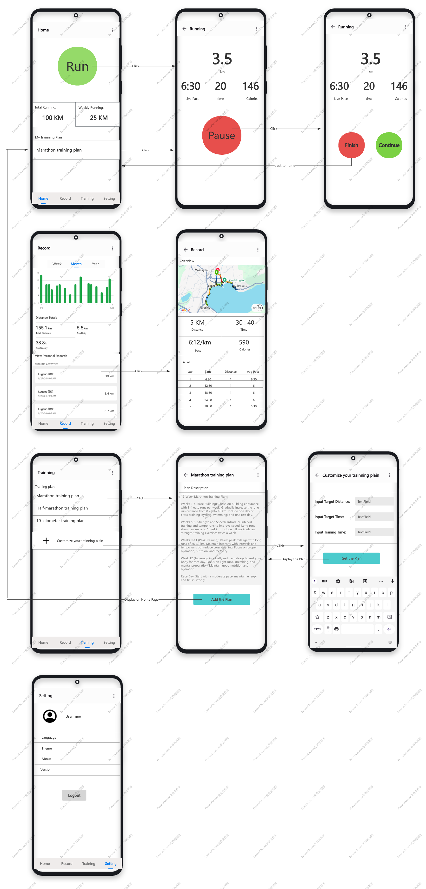

**Group members** : Ding Ning & Wang Zitian & Wang Xiaorui

**Group name**:

1. **What is the name of your app?**

    BestRunner

2. **Which problem does the app solve? (Max. 200 characters)**

    The app tracks and records running data, provides detailed statistical analysis of performance, and offers personalized training plans to improve fitness and running efficiency.

3. **How does your app solve this problem? (Max. 650 characters)**

    We address this problem in the following ways:

* Recording running data: The app uses mobile phone sensors, such as the accelerometer and gyroscope, to detect steps, and GPS to track distance and route. This provides comprehensive data on each run.
* Displaying statistical analysis: It presents key metrics like distance, time, pace, and HRV in daily, weekly, and monthly visual graphs. The app also integrates Google Maps SDK to display running routes.
* Personalized training plans: Using AI technology, the app generates tailored training plans based on users' current running data and their goals, optimizing their performance and progress.

4. **Why is this problem relevant? (Max. 300 characters)**

    This problem is relevant because runners want to track their performance and monitor improvements over time. Having access to detailed running data allows them to understand their progress, while scientifically tailored training plans help them enhance their performance effectively.

5. **Do other apps exist to solve this (or a very similar) problem?**

    Yes

6. **If you answered yes to question 5, list the existing apps that are most related to yours
and explain how these solutions differ from your own. If you answered no to question 5,explain why do you think nobody else has solved this problem before. (Max. 650 characters)**

    Yes, several apps address similar problems, including Garmin Connect, Coros, and Strava. While these apps offer a broad range of features covering various sports and activities, they tend to be more comprehensive and less specialized. In contrast, our app focuses exclusively on running, providing a streamlined and user-friendly experience. We prioritize running-specific data, in-depth analysis, and personalized training plans, without the distraction of unrelated features. This focus allows runners to get the most relevant insights and guidance for their performance improvement.

7. **Which of the built-in sensors of your phone does the app make use of? (Max. 200 char.)**
    
    The app utilizes mobile phone sensors such as the accelerometer and gyroscope to detect steps, and GPS to track distance and routes. It also connects to the server via Wi-Fi or cellular network to request personalized training plans.

8. **Which of the built-in actuators of your phone does the app make use of? (Max. 200 char.)**
    
    The app uses the vibration motor and speaker. Upon starting a run, the phone vibrates to confirm the process has begun. During the run, the app announces key metrics like distance and pace at every kilometer, allowing users to stay informed without checking their phone.

9. **Does your app store sensor data locally, remotely, or in both ways?**
    
    locally.

10. **Motivate your answer to question 9 (i.e., explain why your app stores data and why it
does so only locally/remotely or in both ways). (Max. 650 characters)**
    
    Our app stores data locally to display statistical analysis and generate visual graphs for users. Additionally, it analyzes training data to create personalized plans. We choose to store data locally for two main reasons: First, local storage is sufficient for our needs without the necessity of sending data remotely. Second, it enhances security, as keeping data on the device reduces potential risks associated with remote storage. Therefore, storing data locally is the best option for both functionality and privacy.

11. **Which type of data visualization your app offers and why. If you answered no to question 11, explain why data visualization is not necessary for your app.**

* Line Charts: For displaying patterns over time, such as pace, distance, or heart rate during runs. This allows users to track improvements or identify problems.
* Bar Charts: Great for comparing stats over many runs, such as weekly distances or time spent in different pace zones.
* Heatmaps: Used to depict running intensity by time of day or day of the week, allowing users to see patterns in their performance.
* Maps: Display running routes with lengths, elevation changes, and route comparisons, frequently utilizing GPS data.
* Pie Charts/Donuts: To break out the time spent in different heart rate or pace zones during a run.
* Scatter Plots: Useful for illustrating connections between variables, such as pace against heart rate, which allows users to observe how different aspects affect their performance.

12. **Does your app perform any type of data processing on the collected sensor data?**
    
    Yes

13. **If you answered yes to question 13 explain which type of data processing your app
performs on the collected data and why. If you answered no to question 13 explain why
data processing is not necessary for your app. (Max. 650 characters)**

    Data Cleaning is removing incomplete or incorrect data, such as GPS inaccuracy or outliers in pace owing to signal loss. Accurate data leads to trustworthy analysis.
* Aggregation: Summarizing data across certain time periods (daily, weekly, or monthly) allows users to better understand their general performance patterns, such as total distance traveled or average pace.
* Statistical Analysis: Calculating essential data such as average speed, median heart rate, and total elevation gain gives customers useful feedback on their running experiences.
* GPS Data Processing: Converting raw GPS data into comprehensive route maps, calculating distance, and identifying elevation changes allow users to view their runs and analyze their performance across varied terrains.

14. **How do you evaluate whether your app performs correctly and achieves its goal (i.e., solves the problem described in question 2)? (Max. 650 characters)**
    
* Unit Testing: Check that individual functions, such as pace computation, distance measurement, and data visualization rendering, work as expected. This prevents faults and failures in essential functions.
* Integration tests: Determine how well the app's various components operate together. For example, does GPS data properly integrate into route visualizations? Does the data pipeline efficiently handle incoming data?
* Performance testing involves determining how fast and accurately the app processes huge datasets, particularly when dealing with GPS or heart rate data, as well as if the app can manage long-running sessions or several users without latency.

15. **Which permissions does your app require to be granted by the user? (Max. 200 characters)**
    
* Location (GPS): Tracks the user's running route, calculates distance, and examines speed and elevation statistics. This permission is critical for mapping runs and providing route-based analysis.
* Storage Access: Allows you to preserve user data such as run history, preferences, and settings, as well as export reports and route maps. It also provides access to the user's local files and cloud services for data backup and sharing purposes.Network access: Upload user data to the cloud LLM, analyze the user's running data and provide a plan.

16. **Does the app raise any ethical issues?**
    
    Yes

17. **Motivate your answer to question 16 (Max. 300 char.)**
    
* User Privacy: GPS tracking reveals users' positions, which poses privacy hazards such as revealing home addresses or daily routines. Improper handling or dissemination of this data could pose security risks.
* Data Security: Uploading data to the cloud increases the danger of data breach. To protect user information, cloud providers must include strong encryption and access controls. Unauthorized third-party access to sensitive data may jeopardize user confidence.
* LLM Processing Risks: When LLMs are utilized, they may keep patterns from user data, providing a privacy risk. Full transparency is required regarding what data is processed and how.
* Informed Consent: Users should have a clear understanding of how their data is gathered, stored, and utilized, with the opportunity to opt out of cloud uploads or LLM processing.

18.  **Which are the main challenges that you expect to encounter in order to build your app?(Max. 300 characters)**

Integrating a Large Language Model (LLM) API into a running analysis program may provide many significant challenges
* Data Privacy and Security: Processing sensitive user data while integrating with an LLM presents serious privacy problems. Ensuring that personal data is anonymized and processed securely is critical for preserving user confidence and complying with data protection rules.
* Real-Time Processing: Running applications frequently require real-time feedback, yet LLMs can cause lag in answers. Managing performance and keeping the app fast and responsive is critical for the user experience.
* Model Accuracy and Relevance: LLMs might produce off-topic or erroneous results for specific use situations. Fine-tuning or adapting the LLM for running-related inquiries, as well as assuring the reliability of the advise it gives, will be critical challenges.

19. **Add a sketch for your app storyboard**

20. **Provide description for your app for your app storyboard**
    
    This application is a running app designed to help runners train effectively and improve their running skills. We aim to create a smart running app powered by AI or LLM to serve as an excellent assistant or coach for runners.

    The app features four main tabs at the bottom, each representing a functional module:

* Home: This module is responsible for collecting data during a run and serves as the main entry point to start a run.
* Record: This module organizes and analyzes all of the user's running data, presenting it in charts, graphs, and other reader-friendly formats.
* Training: This module offers a range of training plans. Users can browse various plans and customize their own based on their current level.
* Settings: This module stores information about the app and the user, allowing users to adjust preferences and settings.
