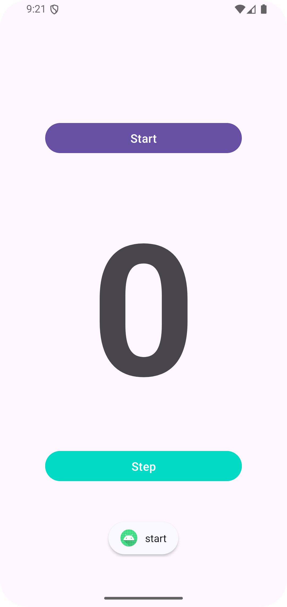

# StepAppV1.1

**Name**: Xiaorui Wang  
**Repo url**: [https://github.com/XiaoruiWang-SH/StepAppV1.1](https://github.com/XiaoruiWang-SH/StepAppV1.1)  
**Screenshots for StepApp:**

## Describe briefly the four components
### Activities
In Android apps, activities serve as the entry point for an app's interaction with the user. It usually represents a single screen with a user interface and each activity handles different parts of the app’s workflow. For example, in WhatsApp each item in bottom tab represents a activity when you click it in. When you chat with your friend in WhatsApp, the view in which your content display and input message is also an activity.  
### Services
A Service is a background component that performs long-running operations without directly interacting with the user. It continues to run even if the user switches to another app. For example, in WhatsApp you maybe make a voice call to your friend, when the app is in the background, you can still taking, this is a service. 

### Broadcast receivers
A Broadcast Receiver responds to broadcasted messages from the system or other apps. It allows an app to react to system-wide events like connectivity changes, battery low warnings, or custom intents from other applications. For example, In WhatsApp, when you reconnect to internet, you will get messages automately.

### Content providers
A Content Provider manages access to structured data in the app, allowing other apps to query or modify the app’s data. Content providers are used to share data between applications. For example, In WhatsApp, user can send a photo to friends selected from photo album on his phone.

## Describe the differences between the View and the ViewGroup UI elements in Android applications.

A View is the basic building block for UI components in Android. It represents a single UI element that can be displayed on the screen, such as a button, text field, or image.    
A ViewGroup is a special type of View that contains and organizes multiple child Views or other ViewGroups. It acts as a container and defines how its child Views are arranged on the screen. Example: LinearLayout, RelativeLayout, and ConstraintLayout.