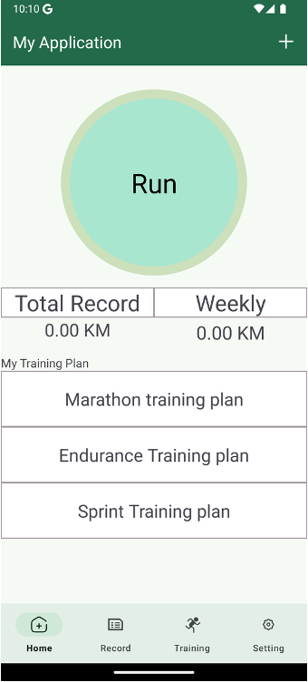
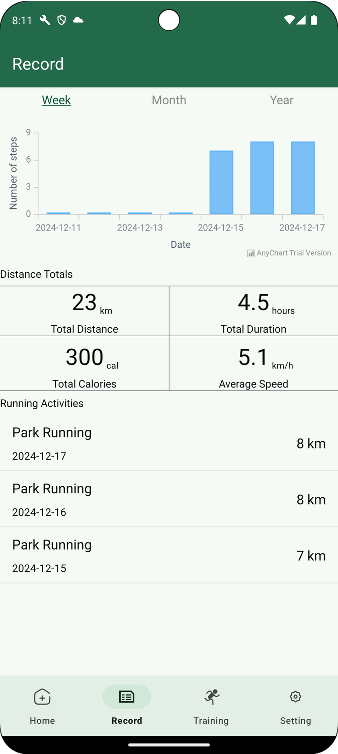
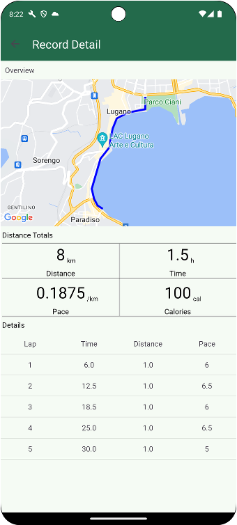

<!--
 * @Author: Xiaorui Wang
 * @Email: xiaorui.wang@usi.ch
 * @Date: 2025-06-20 14:10:43
 * @LastEditors: Xiaorui Wang
 * @LastEditTime: 2025-06-20 14:30:10
 * @Description: 
 * 
 * Copyright (c) 2025 by Xiaorui Wang, All Rights Reserved. 
-->
# StepApp

## Project Overview
StepApp is an innovative application designed to help users track their steps, monitor their fitness goals, and stay motivated through gamification and social features. The app is built using Android development tools and follows modern design principles.

<div style="display: flex; justify-content: space-around;">
  
  
  
</div>

## Features
- Simple, clean, and lightweight design focused on running
- Step tracking and fitness monitoring
- Personalized training plans generated by LLM based on your daily running data
- Gamification elements to encourage activity
- Intuitive and user-friendly interface

## Installation
To set up the project locally:
1. Clone the repository:
   ```bash
   git clone <repository-url>
   ```
2. Open the project in Android Studio.
3. Sync the Gradle files.
4. Build and run the app on an emulator or physical device.

## Usage
1. Launch the app on your Android device.
3. Start tracking your steps and explore the features.

